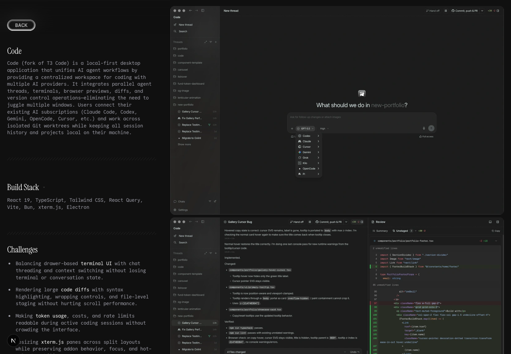
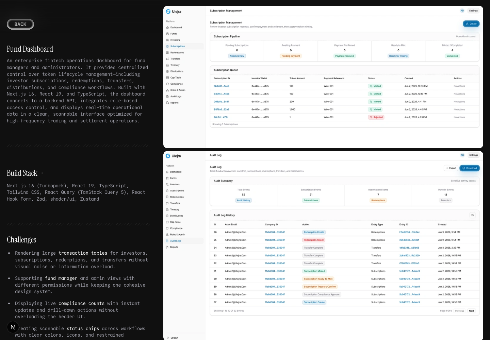

# New Portfolio

A precise portfolio for a multidisciplinary designer, frontend developer, and creative engineer. Visitors — recruiters, design clients, and engineering clients — assess the quality of work, range of disciplines, and fit for a role or project. Success means visitors evaluate with confidence, remember the portfolio, and find a clear path to make contact.

## Preview


| Code project | Fund Dashboard project |
|---|---|
|  |  |

## Stack

- **Framework:** Next.js 16 (App Router)
- **UI:** React 19, TypeScript, Tailwind CSS 4, Motion, shadcn/Base UI
- **Package manager:** Bun

## Prerequisites

- [Bun](https://bun.sh) ≥ 1.3.14

## Getting started

```bash
bun install --frozen-lockfile
bun run dev
```

## Commands

| Command | Description |
|---|---|
| `bun run dev` | Start the development server |
| `bun run build` | Production build |
| `bun run start` | Serve the production build |
| `bun run lint` | Lint with oxlint |
| `bun run typecheck` | Type-check with `tsc --noEmit` |
| `bun run test` | Run tests with vitest |
| `bun run test:watch` | Run tests in watch mode |
| `bun run check` | Lint + typecheck + test (CI gate) |

## Architecture

```
app/                     # Next.js App Router pages and layouts
components/
  home/                  # Home page sections
  portfolio/             # Portfolio gallery components
  project/               # Project detail components
  showcase/              # Interactive showcase components
  ui/                    # Shared UI primitives (shadcn/Base UI)
constants/
  portfolio/             # Project metadata, contact info, social links
  types.ts               # Shared TypeScript types
public/
  showcase-prompts/      # Static prompt assets for showcase components
PRODUCT.md               # Product goals, audience, and success criteria
DESIGN.md                # Design system tokens, typography, and rules
AGENTS.md                # Agent instructions and coding conventions
```

## Content editing

- **Project and showcase metadata:** edit `constants/portfolio/projects.ts`. Each entry defines slug, title, media, and type.
- **Showcase prompt bodies:** static assets in `public/showcase-prompts/`. Treat prompt text as untrusted user-facing content — do not interpolate into active code paths.
- **Contact and social links:** edit `constants/portfolio/contact.ts` and `constants/portfolio/social.ts`.

## Verification before a PR

```bash
bun run check      # lint + typecheck + tests
bun run build      # production build
```

Both must pass. Documentation-only changes should still pass the full gate to confirm nothing else broke.

## Deployment

Standard Next.js production build (`bun run build` followed by `bun run start`). No provider-specific configuration is required.
