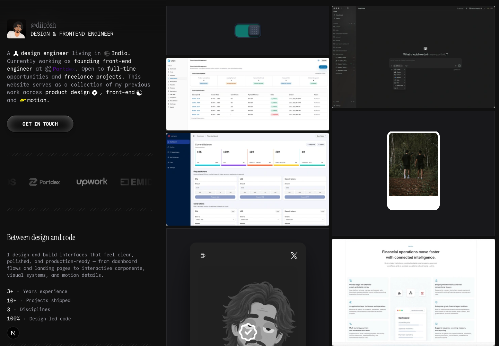

# Dipesh | Design Engineer Portfolio

A production portfolio for a design engineer building polished digital products with strong interface craft, motion, and modern web tooling. It gives recruiters, design clients, and engineering clients a fast way to evaluate the work, inspect the implementation quality, and get in touch.

[](https://diip3sh.xyz)
[](https://nextjs.org)
[](https://react.dev)
[](https://www.typescriptlang.org)
[](https://tailwindcss.com)
[](https://bun.sh)



## Why this exists

The portfolio is designed as evidence of the work itself: precise visual systems, thoughtful interaction details, accessible UI, responsive layouts, and production-ready frontend structure. The goal is not only to list projects, but to make the interface demonstrate design judgment and engineering quality.

## Highlights

- **Design-led home page:** intro, clients, about, stack, experience, awards, hobbies, project gallery, and contact paths.
- **Project detail pages:** case-study style pages with media, metadata, challenges, solutions, and responsive image galleries.
- **Interactive showcases:** focused component demos for motion, UI details, and product interactions.
- **Production fundamentals:** App Router metadata, sitemap, robots, Open Graph image, structured data, and accessible navigation.
- **Quality checks:** oxlint, TypeScript, Vitest, Testing Library, and a single `bun run check` gate.

## Stack

- **Framework:** Next.js 16 App Router
- **UI:** React 19, TypeScript, Tailwind CSS 4, Motion, Base UI, shadcn
- **Testing:** Vitest, Testing Library, jsdom
- **Tooling:** Bun, oxlint, Prettier

## Getting started

```bash
bun install --frozen-lockfile
bun run dev
```

Open `http://localhost:3000`.

## Commands

| Command | Description |
| --- | --- |
| `bun run dev` | Start the development server |
| `bun run build` | Create a production build |
| `bun run start` | Serve the production build |
| `bun run lint` | Lint with oxlint |
| `bun run format` | Format TypeScript and React files |
| `bun run typecheck` | Type-check with `tsc --noEmit` |
| `bun run test` | Run tests with Vitest |
| `bun run test:watch` | Run tests in watch mode |
| `bun run check` | Run lint, typecheck, and tests |

## Project structure

```txt
app/                         Next.js routes, metadata, API routes, sitemap, robots
components/home/             Home page sections
components/portfolio/        Portfolio cards, gallery, navigation, shared layout pieces
components/project/          Project detail page sections
components/showcase/         Interactive showcase components
components/ui/               Shared UI primitives
constants/home/              Home page copy and content data
constants/portfolio/         Contact links, social links, and portfolio project data
constants/projects/          Project navigation and index helpers
docs/                        Implementation notes and screenshots
hooks/                       Shared React hooks
lib/                         Utilities and SEO constants
public/                      Static images, icons, fonts, favicon, and OG assets
sounds/                      Audio assets
```

## Content editing

- **Intro copy:** edit `constants/home/intro.ts`.
- **About and stats:** edit `constants/home/about.ts`.
- **Clients, stack, experience, awards, hobbies, and footer:** edit the matching files in `constants/home/`.
- **Portfolio projects:** edit `constants/portfolio/projects.ts`.
- **Project navigation:** edit `constants/projects/navigation.ts`.
- **Contact and social links:** edit `constants/portfolio/contact.ts` and `constants/portfolio/social.ts`.
- **SEO title, description, canonical URL, and social image:** edit `lib/seo.ts`.
- **README screenshot:** update `docs/screenshots/home.png`.

## Verification

Run the full gate before opening a PR or deploying:

```bash
bun run check
bun run build
```

Both commands should pass. Documentation-only changes should still run the full gate when practical so stale imports, broken tests, or framework changes are caught early.

## Deployment

Build with `bun run build`, then serve with `bun run start`. The app is a standard Next.js production build and does not require provider-specific configuration.

## License

Released under the [MIT License](LICENSE).
